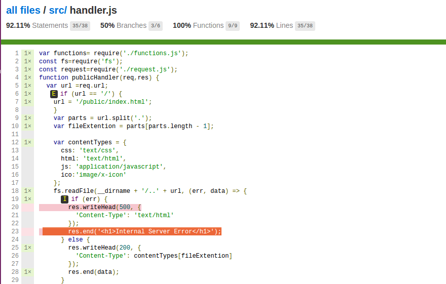
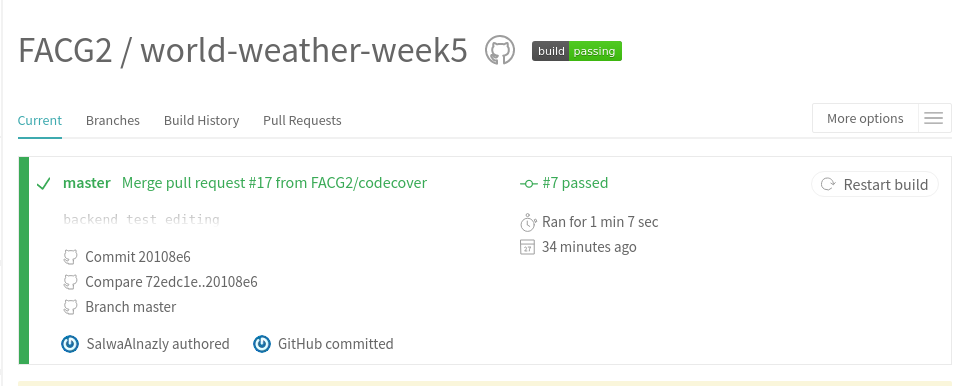
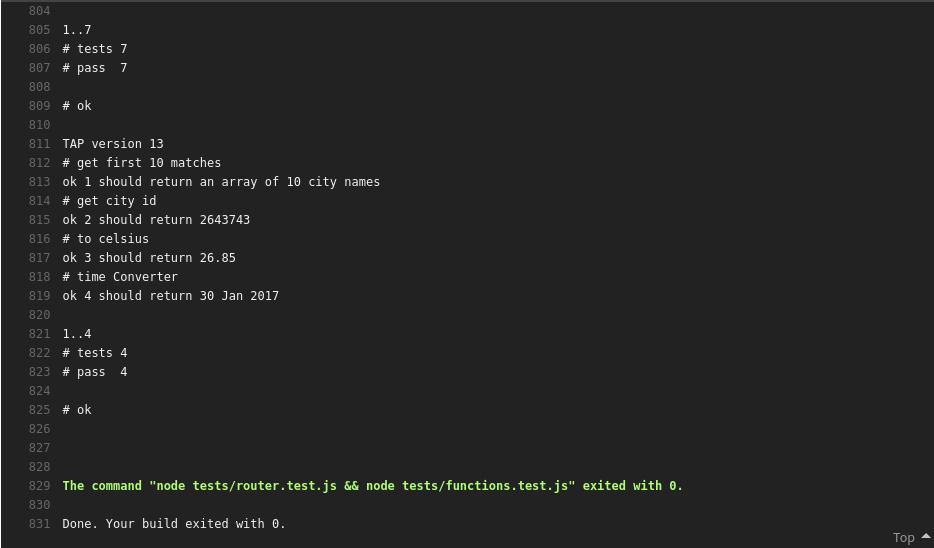

# world-weather-week5
a web app to get current weather in every city in the world.

## Project idea
An app that uses  API to display current and tommorrow weather data for any city in the world

## Project Requirements
- [x] Use at least 1 API
- [x] Make your API calls from the back-end using the request module
- [x] Your server should contain a minimum of 2 routes
- [x] Back-end testing using tape (test as many components as you can) and basic front-end testing.
- [x] Test your server by injecting fake HTTP requests using Shot.
- [x] Host your project on heroku, see resources
- [x] Use module.exports and require to break a single large server file into smaller modules.
- [x] Consider a good server file structure based on what we have discussed over the week.
- [x] Employ continuous integration on your project with Travis or a similar tool.
- [x] Use CodeCov or a similar tool for test coverage.
- [ ] Display continuous integration and code coverage badges on your project README.
- [x] Ensure that errors are handled, if for example a user attempts to make a request to a non-existent route to your server, provide the user with a custom response.

### Day 1

- Discuss app purpose and architecture
- Create initial folder structure and files
- Add more specific back-end tests

### Day 2

- Enable back-end to pass relevant data to the front-end
- Set up Codecov, Travis, Istanbul and initial tests using tape and shot
- Set up Heroku
- Add styling and DOM manipulation to display data

## Code coverage

## Continuous integration

### Installation instructions
 git clone `https://github.com/FACG2/world-weather-week5`

  Run `npm install` to install all dependencies`

  Run  `npm start `

Navigate to http://localhost:4000/ in your browser

[check the site](https://weathergaza.herokuapp.com/)

>Done By : Abdallah,Hana,Mahmoud,Salwa
